# 📖 Japanese Exam Question Bank Management System

A powerful desktop application built with Java and JavaFX, designed for the comprehensive management of a Japanese language question bank and the creation of exams. This project integrates modern technologies like Optical Character Recognition (OCR) and Artificial Intelligence (AI) to streamline the exam creation workflow.

## ✨ Core Features

-   **Question Management:** Add, edit, delete, search, and filter questions based on various criteria (question type, difficulty level, tags).
-   **Exam Management:**
    -   Manually create exams by selecting questions from the bank.
    -   Automatically generate exams based on predefined parameters.
    -   Export exams and separate answer keys to PDF format.
-   **Smart Input (OCR):** Utilizes **Tesseract OCR** to scan images and automatically convert them into question content, saving significant data entry time.
-   **AI Suggestions:** Integrates **Gemini AI** to analyze questions from OCR and provide answer suggestions, speeding up the drafting process.
-   **Intuitive UI:** A user-friendly and easy-to-navigate graphical user interface built with JavaFX.

## 🖼️ Application Screenshots

<details>
<summary><b>Click here to view the feature screenshots</b></summary>

| Feature | Screenshot |
| :--- | :---: |
| **Main UI - Question Management** | 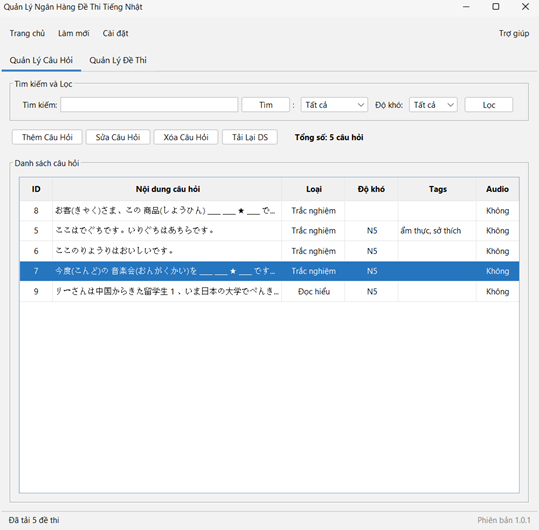 |
| **Add New Question** | 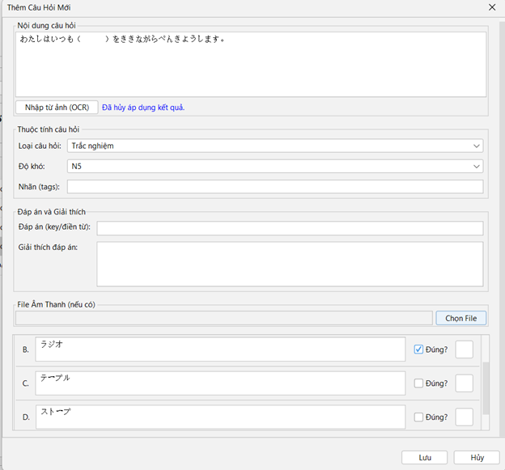 |
| **Edit Question Information** | 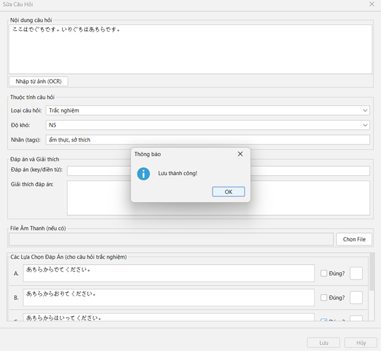 |
| **Delete Question Confirmation** | 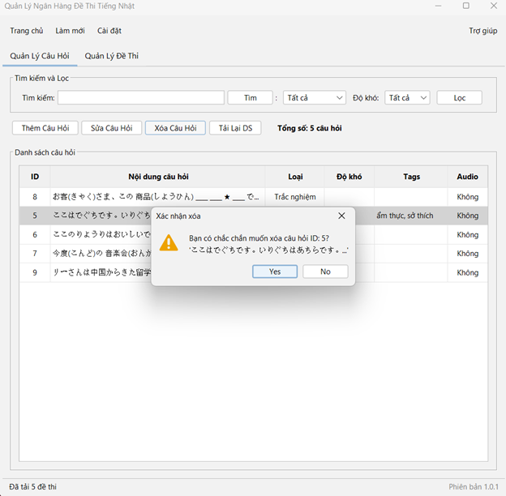 |
| **Filter Questions by Criteria** | 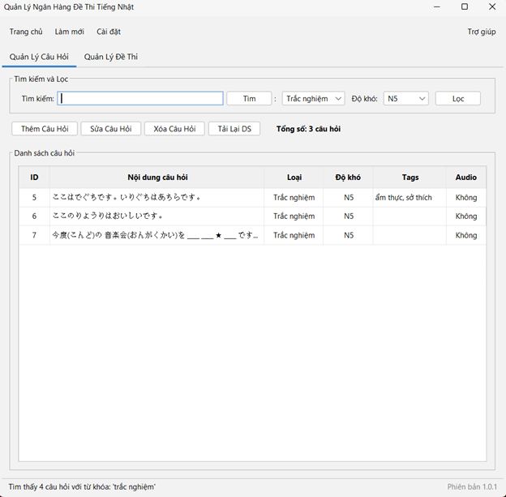 |
| **Import from Image (OCR) & AI Suggestion** | 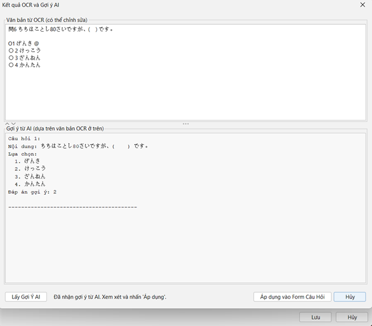 |
| **Main UI - Exam Management** | 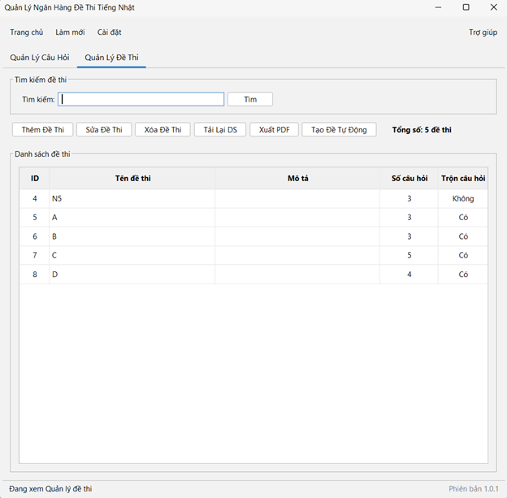 |
| **Create Exam Manually** | 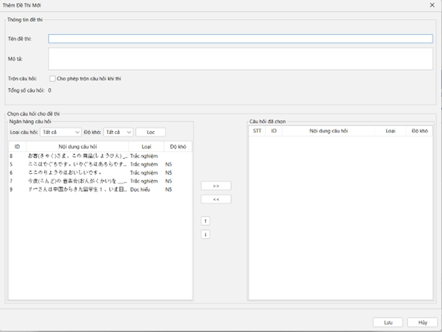 |
| **Export Exam to PDF** | 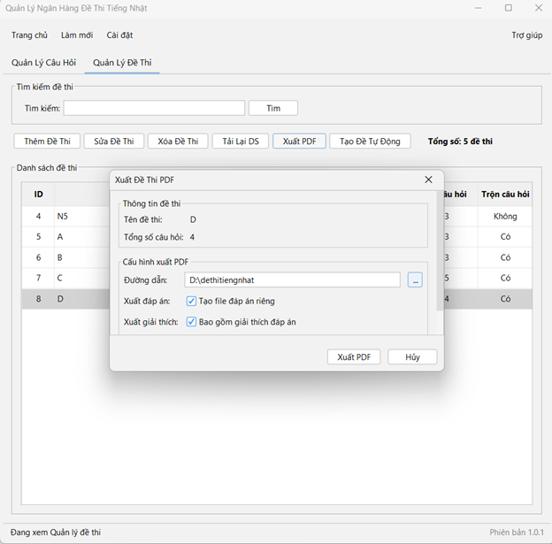 |
| **Edit Exam Information** | 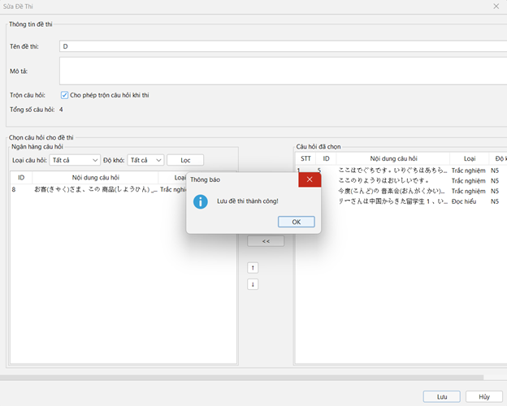 |
| **Delete Exam Confirmation** | 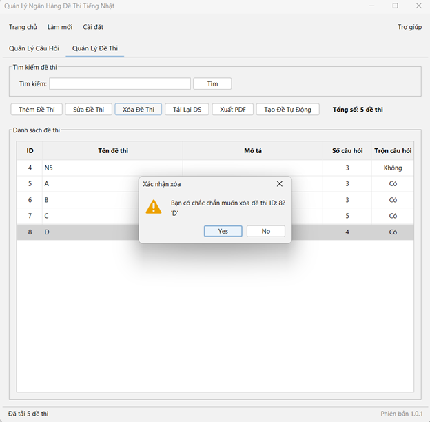 |
| **Create Exam Automatically** | 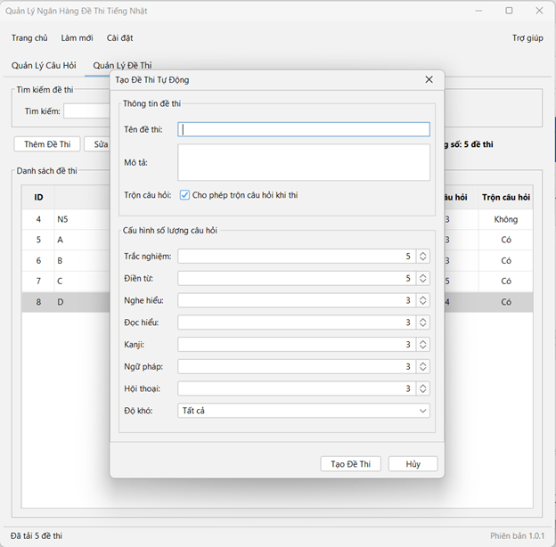 |

</details>

## 🛠️ Technology Stack

-   **Language:** Java 11
-   **UI Framework:** JavaFX
-   **Build Tool:** Apache Maven
-   **Database:** MySQL 8.0+
-   **Core Libraries:**
    -   `mysql-connector-j`: For communicating with the MySQL database.
    -   `Tess4J`: A Java wrapper for the Tesseract OCR engine.
    -   `Gemini API Library`: For integrating Google's language model.
    -   *Other libraries for PDF handling, logging, etc.*

## 💻 System Requirements

-   **Operating System:** Windows 10/11 (64-bit), macOS (Catalina+), Linux (Ubuntu 20.04+).
-   **Java Development Kit:** **JDK 11**.
-   **Database:** **MySQL Server 8.0.x** or higher.
-   **OCR Engine:** **Tesseract OCR 5.x.x** (required for the image import feature).
-   **RAM:** Minimum 4GB (8GB+ recommended).
-   **Hard Disk Space:** Approximately 1-2GB of free space.

## 🚀 Setup and Run Instructions

### Step 1: Install Prerequisites

1.  **Java Development Kit (JDK 11):**
    -   Download and install from [Adoptium (Temurin)](https://adoptium.net/temurin/releases/?version=11).
    -   Set up the `JAVA_HOME` environment variable and add it to your `PATH`.

2.  **MySQL Server & Workbench:**
    -   Download and install from the [official MySQL website](https://dev.mysql.com/downloads/mysql/).
    -   **Important:** Remember the `root` password you set during installation.

3.  **Tesseract OCR:**
    -   Download the installer from [UB Mannheim Tesseract builds](https://github.com/UB-Mannheim/tesseract/wiki).
    -   **CRITICAL:** During installation, at the "Choose Components" step, check **"Additional language data"** and ensure both **"Japanese"** and **"English"** are selected.
    -   Add the Tesseract installation directory to your system's `PATH` environment variable.

### Step 2: Set up the Database

1.  Open MySQL Workbench and connect to your local server.
2.  Create a new schema (database) named `NGAN_HANG_DE_THI`.
3.  Execute the entire SQL script provided in the project documentation to create the necessary tables and structure.

### Step 3: Configure the Project

1.  **Clone the project repository:**
    ```sh
    git clone [YOUR_REPOSITORY_URL]
    cd [YOUR_PROJECT_DIRECTORY]
    ```
    Or, extract the project's ZIP file.

2.  **Configure Database Connection:**
    -   Open the file: `src/main/java/com/tiengnhat/db/DatabaseManager.java`.
    -   Update the `DB_USER` and `DB_PASSWORD` values to match your MySQL credentials.
    ```java
    private static final String DB_USER = "root"; // Replace with your username
    private static final String DB_PASSWORD = "your_mysql_password"; // Replace with your password
    ```

3.  **Configure Gemini API Key:**
    -   Open the file: `src/main/java/com/tiengnhat/service/GeminiAIService.java`.
    -   Replace the placeholder string with your actual API key.
    ```java
    private static final String YOUR_API_KEY_HERE_FOR_LOCAL_TESTING = "YOUR_REAL_GEMINI_API_KEY";
    ```

4.  **Configure Environment Variable for Tesseract:**
    -   Create a new system environment variable:
        -   **Variable name:** `TESSDATA_PREFIX`
        -   **Variable value:** The path to your Tesseract installation directory (e.g., `C:\Program Files\Tesseract-OCR`). This directory must be the parent of the `tessdata` folder.

5.  **Prepare Fonts:**
    -   Download the `NotoSansJP-Regular.ttf` font (or a similar Japanese font that supports Unicode).
    -   Place the font file inside the `src/main/resources/fonts` directory.

### Step 4: Build and Run

1.  Open the project in your preferred Java IDE (IntelliJ, Eclipse, VSCode).
2.  Wait for the IDE to recognize the `pom.xml` file and download all the required Maven dependencies.
3.  Navigate to the file `src/main/java/com/tiengnhat/ui/MainApp.java`.
4.  Right-click and select **Run 'MainApp.java'** to launch the application.

## 🤔 Troubleshooting

-   **Database Connection Error?**
    -   Double-check your username and password in `DatabaseManager.java`.
    -   Ensure the MySQL Server service is running.
    -   Check if your firewall is blocking port 3306.
-   **Gemini API Key Error?**
    -   Verify that the API key is correct and still valid.
    -   Check your internet connection.
-   **Tesseract (Tess4J) Error?**
    -   If you see an `Unable to load library 'tesseract'` error, ensure the `TESSDATA_PREFIX` environment variable is set correctly.
    -   Make sure the `tessdata` directory contains the `jpn.traineddata` file.